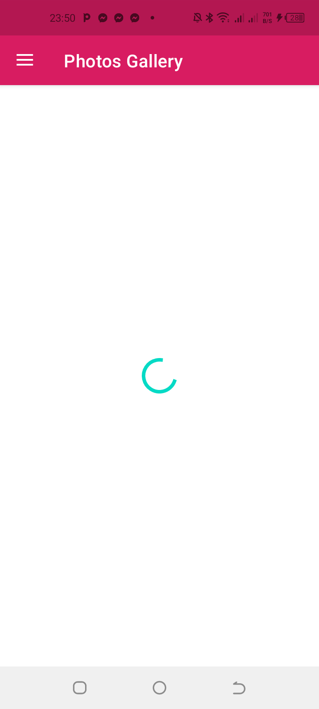
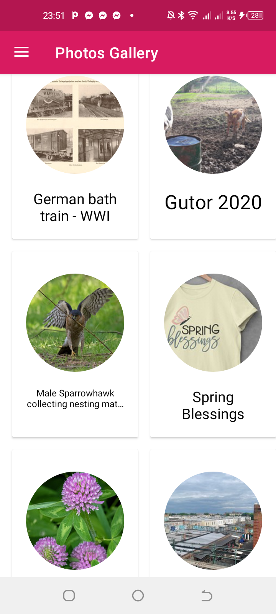
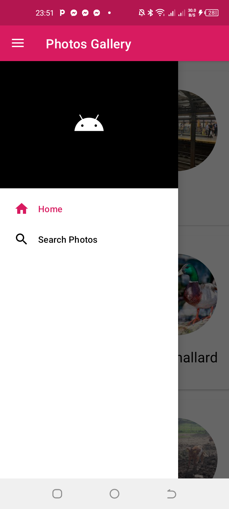
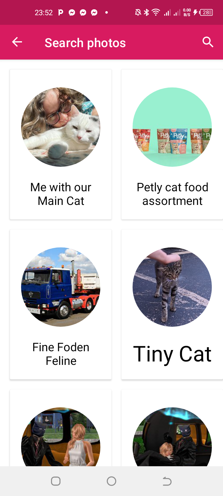
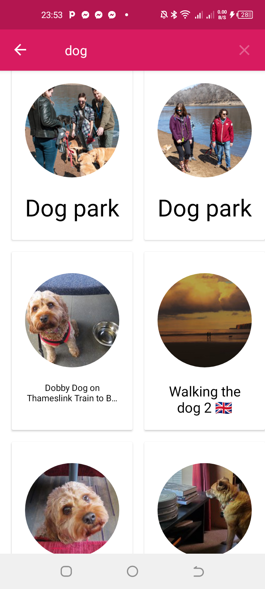
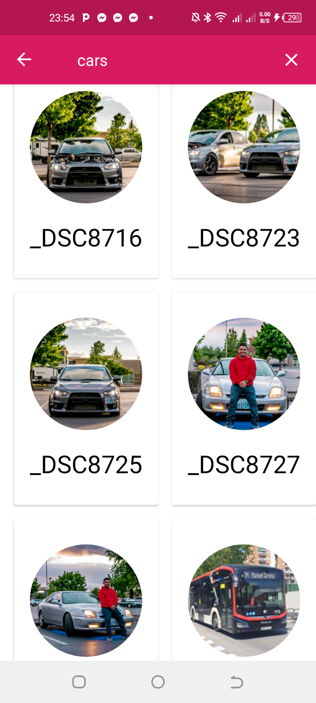

Image Gallery App
===============

This is an assignment for internship. It's a task given by the employer to test applicants skills.

An app that fetches images from [Flickr](https://www.flickr.com/services/developer/api/) API and 
displays them on the screen. The user can directly get  a list of images from the API and displays see them on the screen or 
search images by name from the API. In all cases, the image are fetched from the API and saved in 
Room database before being retrieved and displayed by the UI.

How does it work?
================
By default, it has a list of cats on the screen. This is achieved with [flickr.photos.getRecent](https://www.flickr.com/services/api/explore/flickr.photos.getRecent)
The user can use the search screen from the navigation drawer bar to enter a query depending on what
he wants to search. After entering his query, he will get a list of photos or images. This is done 
with [flickr.photos.search](https://www.flickr.com/services/api/flickr.photos.search.html)

These screens show the above description:

 |  |  |  |  | 
------------|--------------|-------------|----------------|---------------|---------------
Loading     | Home screen  | Nav drawer  | Search screen  |  Search dogs  | Search cars

Tech Stack used:
===============
### Kotlin language
### Kotlin coroutine
### Paging3 library
### Glide library
### Dependency injection with Dagger Hilt
### Retrofit with moshi
### View Binding
### Navigation Components
### MVVM Architecture
### Repository pattern
### Room database
### Flickr API

I hope you enjoyed it.

Thank you so much for reading.

Let's be friends:
* [LinkedIn](https://www.linkedin.com/in/esp%C3%A9rant-gada-b88469208/)
* [Email](mailto:esperantgada@gmail.com)
* [Github](https://github.com/esperantgada)
* [Facebook](https://web.facebook.com/gada.esperant/)
* [WhatsApp](https://wa.me/0022997756877)

